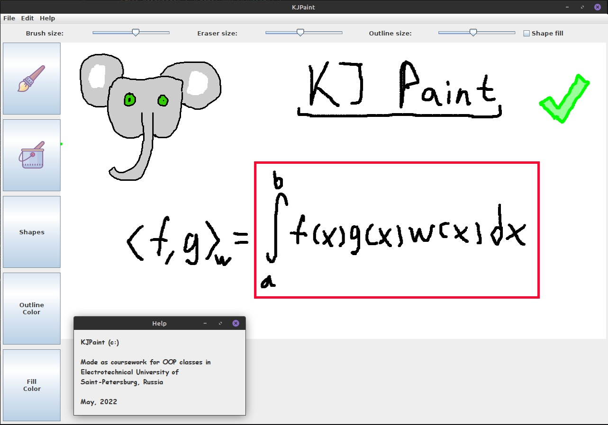

# Overview

This is an old coursework project for OOP discipline in university. It represents a simple drawing program written on Kotlin and using `Java Swing` for GUI.

*Totally didn't spend five hours to paint this preview (not really).*

## Description

In this simple program you can:

+ Draw with "brush" (Left Mouse Button, `LMB`),
+ Erase (Right Mouse Button, `RMB`)
+ Fill closed contour,
+ Change colors for both outline and fill,
+ Draw different simple shapes, such as rectangle, ellipse and straight line,
  + Shapes can take "right" shape by pressing `Shift` -- so, you get square, circle and line with convenient degree (45 or 90 in every direction)
+ Save your ~~masterpiece~~ drawing in file,
+ *Use buffer*: return to previous or next action by pressing `Ctrl + Z` and `Ctrl + Y` hotkeys, respectively.

## Conclusion

Many thanks for icons, [icons8.ru](https://icons8.ru/).